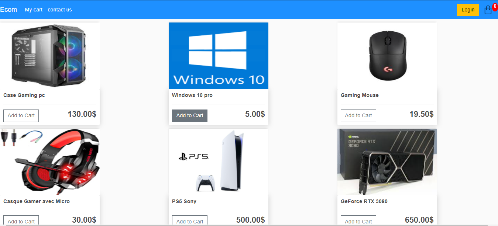
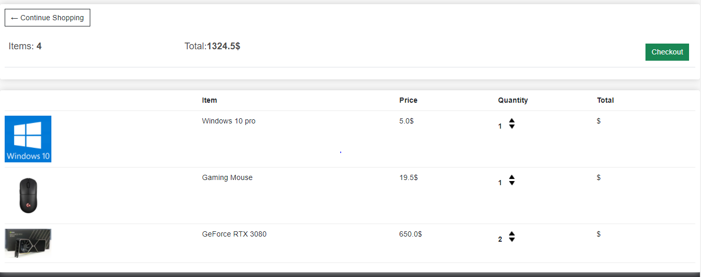
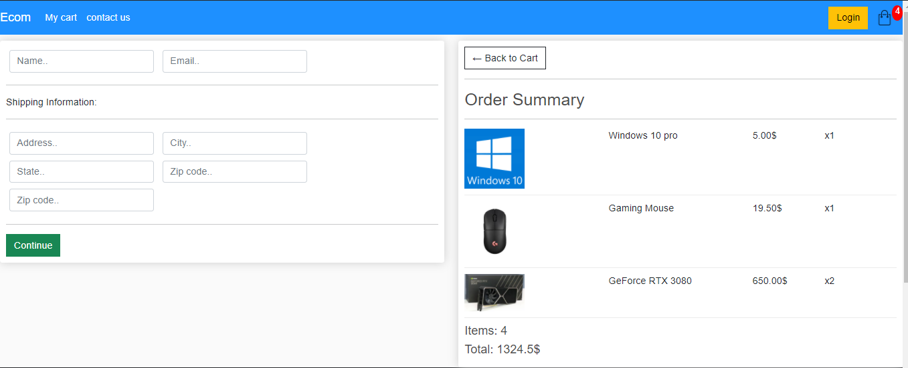
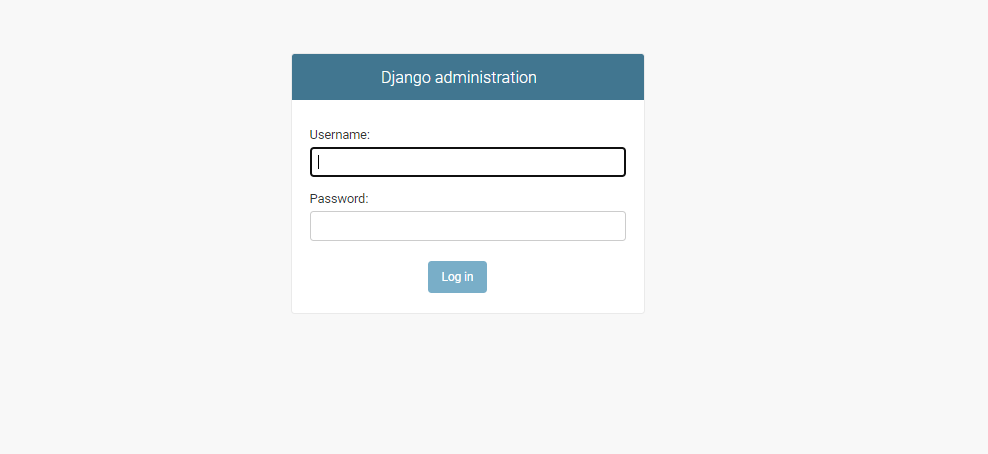
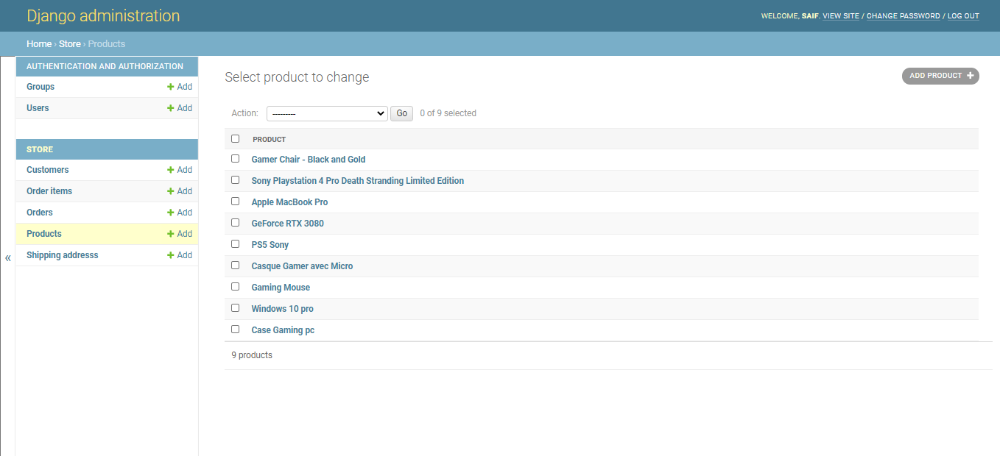

# E_commerce
e-commerce django
## run website from terminal
>go to terminal and enter `py manage.py runserver`
```
then go to `localhost:8000`
```
## Home page:

## Cart page:

## Checkout page:


### admin page:

```
link=localhost:8000/admin
user=Saif
password=123321
```
## adding products:
go to product module in django admin 

